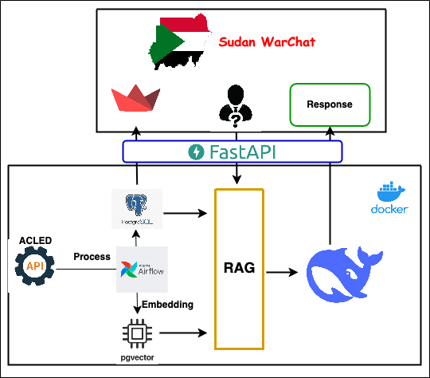
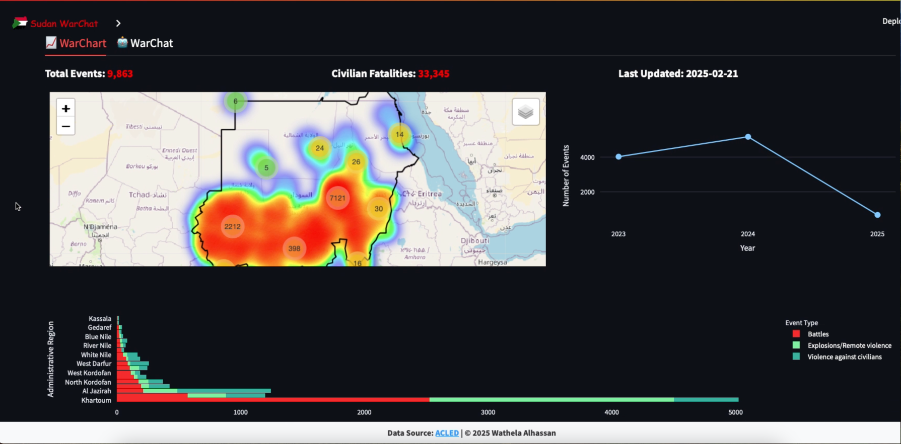
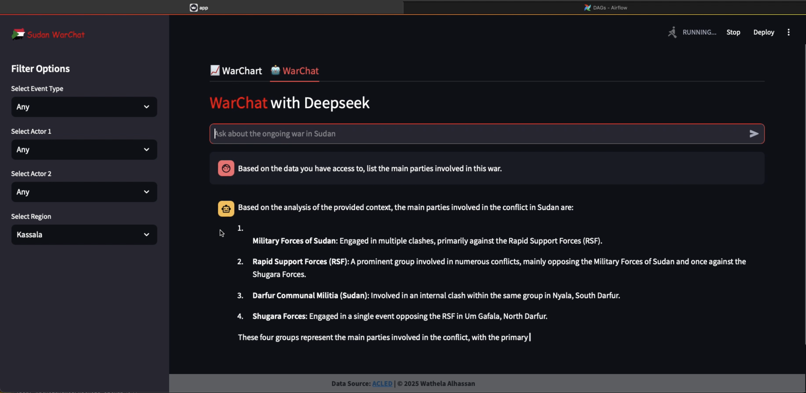

# **WarChat**  
### **AI-Powered Conflict Monitoring for Sudan**  

WarChat is an AI-driven web application designed to track and analyze the ongoing war in Sudan. It integrates advanced technologies to provide real-time insights and intelligent retrieval of conflict-related information.  

## **Tech Stack**  

🚀 **Core Components:**  
- **DeepSeek Distilled R1** – Primary AI model for chat-based analysis  
- **Ollama** – Runs DeepSeek locally for efficient processing  
- **Knowledge Base RAG** – Context-aware retrieval system  
- **Nomic-Embed-Text** – For data embedding for semantic search 
- **pgvector** – Vector database for embedding storage 
- **Cosine Similarity** – For matching user prompt with stored embedding  

🛠 **Infrastructure & Deployment:**  
- **FastAPI** – Backend API endpoints 
- **Streamlit** – APP frontend  
- **Airflow & Spark** – For ACLED data orchestration and automated daily updates  

## **System Flowchart**  

    

## **Screenshots**  

    

  

    

  

## **Contact**  
📧 [wathelahamed@gmail.com](mailto:wathelahamed@gmail.com)  

## **License**  
[MIT License](LICENSE)